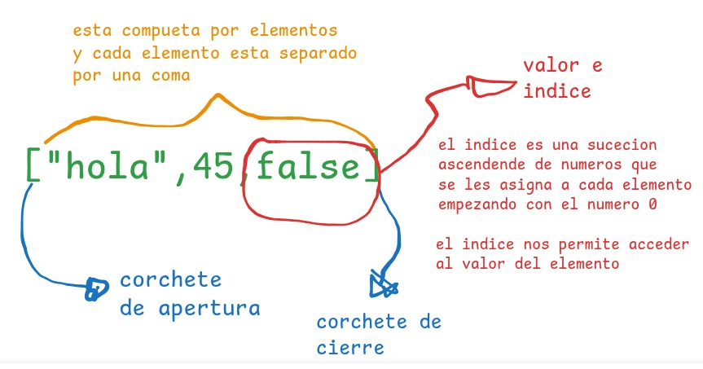
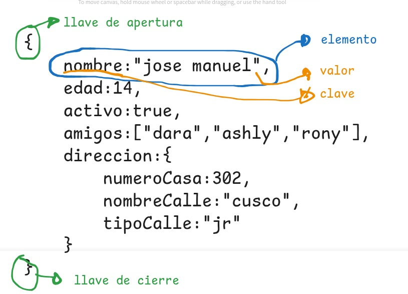

# taller de repaso javascript
> [!WARNING] observacion:quokka se debe ejecutar en cada archivo.

> [!TIP]quokka detecta que en nuestro proyecto tenemos nodejs y lo ejecuta para poder ver la consola en vivo.
## 1. tipos de datos
es la manera como capturamos la informacion en java script se clasifican en dos grandes grupos.
> [!TIP] Javascript  tiene funciones predeterminadas por ejemplo para mostrar un mensaje por consola console.log(), para poder verificar que tipo de datos estamos manejando en javascrip tambien tenemos una funcion por defecto llamada typeof `typeof()`
> 
### Primitivos
son datos que siempre existiran
1. numericos 
   - enteros positivos
   - enteros negativos :son los numeros que mas bits ocuparan en la memoria
   - decimal positivo: son los mas graandes
   - decimal negativo
   - NaN (Not a number)
2. texto
   - caracteres    - 10001001 -97 -A
   - Caracteres especiales : tienen 16 bits -0100
   - string
3. booleanos
   - true -1
   - false -0

### Estructurados

1. Array (lista)
   - array de tipo numerico
   - array de tipo string
   - array de tipo mixto 
   - como esta estructura un array en javascript
 - 

2. Objetos(diccionario)
son similares a las listas con la unica diferencia que en vez de tener valor e indice sus elementos trabajan con clave:valor
- como esta estructurado un objeto en javascript
- 

## 2. variables(enlaces,binding)
es la tecnica que se usa para poder apuntar a una direcciob en memoria y al valor o dato relacionado o que se encuentre almacenado en ese momento.
tenemos dos pasos para creara una variable
1. primero declarar la variable/constante
2. segundo inicializar la variable/constante
**Observacion** para crear una variable primero tenemos que crear el enlace luego darle el nombre de la variable/constante:para las variables tenemos las palabras reservadas `keyword` - `let` ,  `var`, para las constantes tenemos la palabra reservada `keyword` - `const`
**Recomendaciones**
`let` usar cuando el valor tendra que variar
`const` usar cuando el valor sera el mismo siempre
 `var` evitar usar.
 `let` ,  `var` ambos nos permiten crear variables su unica diferenca es el alcanse ambito o `scope`
 averiguar

## 3. operadores
## 4. Funciones
## 5. metodos para trabajar con datos estructurados
### acceder
### modifica
### crear
### insertar
### eliminar
### ordenar